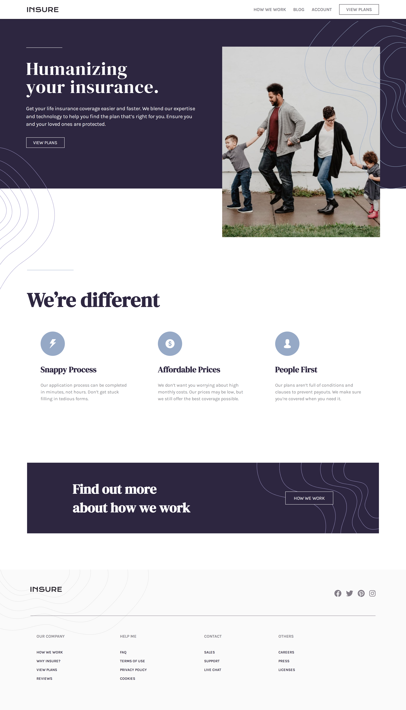

# 👩‍💻 Insure landing page 

## The challenge

The challenge is to build out this landing page and get it looking as close to the design as possible.

Users should be able to:

- View the optimal layout for the site depending on their device's screen size
- See hover states for all interactive elements on the page

## Built with

- Semantic HTML5 markup
- CSS custom properties
- Flexbox
- Mobile-first workflow

  <h3>
    <a href= "https://amansgz.github.io/css-insure-landing-page/">
      Live site
    </a>
     | 
    <a href= "https://www.frontendmentor.io/challenges/insure-landing-page-uTU68JV8">
      Challenge
    </a>
  </h3>

This application/site was created as a submission to <a href= "https://www.frontendmentor.io/">Frontend Mentor Challenges</a> 
